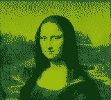

# GameBoyFullScreen
A simple script to display a single full-screen image on a Game Boy.

## Requirements
 - [RGBDS](https://github.com/gbdev/rgbds)
 - make

## Usage
1. Replace `image.png` with your image. It must be 160 * 144 with 4 colours.
2. Run `make` to build the ROM.
3. The ROM is output in `bin/FullScreenImage.gb`.

## Background
Normally, the Game Boy's background layer is only capable of addressing 256 unique tiles at once. This seemingly makes a full screen image impossible, as that would require 360 tiles. However, the background can switch to another "bank" of tiles, adding an additional 128 possible tiles. By switching to this alternate bank mid-screen using an LYC interrupt, a full screen image can be shown.

